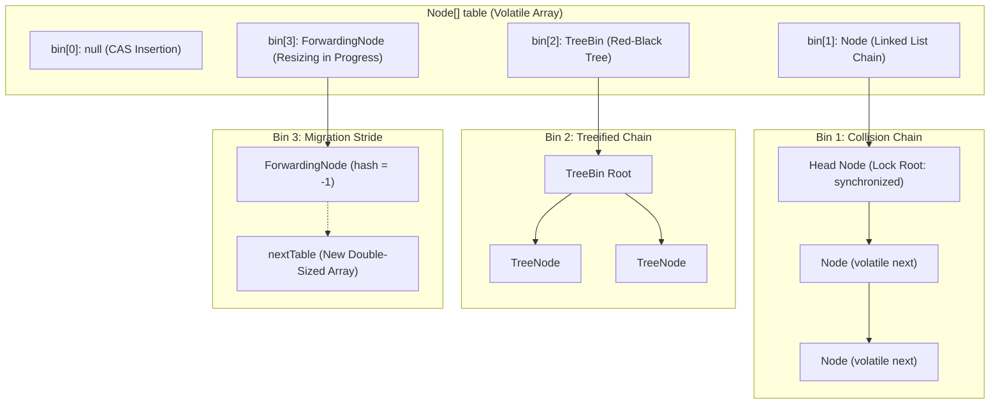

# Deep Dive: Java `ConcurrentHashMap` (Java 8 — Java 21+)

## 🗺️ Topic Breakdown: `ConcurrentHashMap`

1. **Problem Context & Motivation**: The fatal bottlenecks of `Hashtable` and `Collections.synchronizedMap`.
2. **Prerequisites & Cognitive Foundations**: Hardware cache coherence, CAS, volatile semantics, and bucket arrays.
3. **Core Architectural Evolution**: Java 7 (16-Segment Striping) vs Java 8+ (Per-Bin Lock + CAS).
4. **Internal Mechanics & Algorithms**:
   - Lock-free reads (`volatile val` & `volatile next`).
   - Empty bucket insertion via hardware CAS (`casTabAt`).
   - Collision handling via intrinsic head-node monitor (`synchronized(firstNode)`).
   - Treeification to Red-Black trees (`TreeBin`) at `TREEIFY_THRESHOLD = 8`.
5. **Cooperative Multi-Threaded Resizing**: `sizeCtl`, `ForwardingNode`, and thread-assisted bin migration.
6. **Concurrent Size Accounting**: Distributed accumulation via `CounterCell` (LongAdder architecture).
7. **The "No-Null" Contract**: The fatal check-then-act ambiguity resolved.
8. **Runnable Code & Execution Step Visualizer**: Hands-on snippet with Python Tutor deep link.
9. **Hands-on Practice & LeetCode Patterns**: Easy, Medium, and Hard challenges.
10. **Interview Traps & Myths**: What candidates get wrong vs JVM reality.

---

## 1. What Problem This Solves (The Motivation)

Imagine a high-traffic distribution warehouse with thousands of independent storage lockers. In older Java designs (`Hashtable` and `Collections.synchronizedMap`), the warehouse placed a single armed guard at the front gate: only one worker could enter the entire warehouse at a time, forcing dozens of other workers to wait outside in the freezing cold even if they needed completely different lockers. `ConcurrentHashMap` eliminates this global chokepoint by replacing the single gatekeeper with individual locks on each individual locker bin. Multiple worker threads can deposit items into different bins simultaneously without interfering with each other. Furthermore, workers who only need to inspect what is inside a locker (readers) look straight through transparent glass doors—they never wait for a guard, never acquire a lock, and never block.

---

## 2. Prerequisite Foundations (RPKT Graph)

Before diving into the internal mechanics, ensure you have reviewed these foundational building blocks:

- **Documented Prerequisite Guides**:
  - [volatile Keyword & Memory Visibility](file:///Users/Vinay_Neelapu/Workspace/personal/java_learning/Java_Learning/src/htmlDocuments/collections/05-concurrency.html#chm): Guarantees direct read/write access to CPU L1/L2 caches and memory buses without stale thread-local registers.
  - [Compare-And-Swap (CAS)](file:///Users/Vinay_Neelapu/Workspace/personal/java_learning/Java_Learning/src/htmlDocuments/collections/05-concurrency.html#cas-sim): Atomic hardware primitive that updates a memory location only if it matches an expected value.
  - [Happens-Before Relationship](file:///Users/Vinay_Neelapu/Workspace/personal/java_learning/Java_Learning/src/htmlDocuments/collections/01-jvm-memory-and-foundations.html): JMM formal ordering rules preventing instruction reordering.
  - [Hash Bucket Array & Hashing](file:///Users/Vinay_Neelapu/Workspace/personal/java_learning/Java_Learning/src/htmlDocuments/collections/03-maps-and-sets.html): Array indexing via hash perturbation and modulo bitmasking.
  - [Bucket Treeification](file:///Users/Vinay_Neelapu/Workspace/personal/java_learning/Java_Learning/src/htmlDocuments/collections/03-maps-and-sets.html): Converting $O(N)$ linked collision chains into balanced $O(\log N)$ Red-Black trees.
- **Foundational Concepts**:
  - `[[cpu-cache]]`: Multi-core MESI cache-coherency protocols.
  - `[[atomic-operations]]`: Single-clock-cycle CPU bus locking or cache-line reservation (`CMPXCHG`).
  - `[[thread-basics]]`: Context switching, runnable vs blocked states.
  - `[[red-black-tree]]`: Self-balancing binary search trees with red and black node coloring constraints.

---

## 3. Verified Architectural Evolution (Java 7 vs Java 8+)

> [!NOTE]
> **Verified Version Milestone (Java 8 through Java 21+)**:
> In Java 7, `ConcurrentHashMap` partitioned the table into an array of 16 independent `Segment<K,V>` instances, where each `Segment` was a subclass of `ReentrantLock`. This achieved a concurrency level of 16, but global operations (like resizing or accurate size calculation) had to acquire locks across all 16 segments simultaneously.
>
> In **Java 8**, Doug Lea completely rewrote `ConcurrentHashMap`. Segments were removed in favor of a single flat bucket array (`Node<K,V>[] table`), utilizing **hardware CAS for empty bins** and **synchronized locking on only the head node of individual bins** when collisions occur.

### Comparison Table

| Feature | `Hashtable` | `ConcurrentHashMap` (Java 7) | `ConcurrentHashMap` (Java 8+) |
|---|---|---|---|
| **Locking Granularity** | Entire map (`synchronized` methods) | 16 discrete Segments (`ReentrantLock`) | Single bin head node (`synchronized(firstNode)`) |
| **Empty Bin Insert** | Takes global monitor lock | Locks specific segment | **100% Lock-free** via CAS (`casTabAt`) |
| **Reads (`get`)** | Blocked by concurrent writes | Non-blocking via volatile | **100% Non-blocking** via volatile reads |
| **Collision Worst-Case** | $O(N)$ linked list | $O(N)$ linked list | $O(\log N)$ Red-Black Tree (`TreeBin`) |
| **Resizing Behavior** | Global Stop-the-world lock | Per-segment locking | **Cooperative Multi-Threaded** (`ForwardingNode`) |
| **Null Keys / Values** | Null keys/values forbidden | Forbidden | **Strictly Forbidden** (`NullPointerException`) |

---

## 4. Internal Mechanics & Algorithms

### Internal Constants & Thresholds
- `TREEIFY_THRESHOLD = 8`: Number of nodes in a single bucket chain required to convert into a `TreeBin`.
- `UNTREEIFY_THRESHOLD = 6`: When shrinking during resizing or removal, tree unwinds back to a linked list.
- `MIN_TREEIFY_CAPACITY = 64`: Minimum total table capacity before treeification occurs; if capacity is below 64, table resizes instead of treeifying.
- `MOVED = -1`: Special hash assigned to `ForwardingNode` indicating bin migration in progress.
- `TREEBIN = -2`: Special hash assigned to the root holder of a Red-Black tree.
- `RESERVED = -3`: Special hash placeholder used during `computeIfAbsent` calculations.

### Internal Bucket Memory Architecture



### The Read Path: 100% Lock-Free

Why can `get(Object key)` run without acquiring any lock, even while other threads are inserting or deleting nodes?
1. **Volatile Array Reference**: The `table` array itself is volatile.
2. **Volatile Cell Lookups**: Bin heads are fetched using Unsafe/VarHandle `tabAt()` which performs a volatile read (`getObjectVolatile`).
3. **Volatile Next & Val**: Within `Node<K,V>`, both `val` and `next` are explicitly declared `volatile`:
   ```java
   static class Node<K,V> implements Map.Entry<K,V> {
       final int hash;
       final K key;
       volatile V val;
       volatile Node<K,V> next;
   }
   ```
4. **Hardware Visibility**: Under the Java Memory Model, a volatile write to `val` or `next` establishes a *happens-before* relationship with any subsequent volatile read. The reading CPU core directly accesses fresh values from the hardware cache coherence bus without thread blocking.

### The Write Path: CAS First, Synchronize Only on Contention

When executing `put(K key, V value)`:
1. **Hash Perturbation**: Computes spread hash `(h ^ (h >>> 16)) & HASH_BITS` to distribute keys across power-of-two table lengths.
2. **Empty Bin Path (CAS)**:
   - If `tabAt(tab, i) == null`, the thread attempts to insert a new `Node` using atomic CAS (`casTabAt`).
   - If CAS succeeds, the insertion completes with **zero locks acquired**.
   - If another thread slipped an element in at the exact same millisecond, CAS fails, and the loop repeats (spin retry).
3. **Resizing Detection**:
   - If `node.hash == MOVED` (-1), the thread realizes this bucket is already being transferred to a new table. It calls `helpTransfer()` to assist in copying bins instead of idling.
4. **Collision Path (`synchronized`)**:
   - If the bin is non-empty and not moving, the thread synchronizes **only on the head node**:
     ```java
     synchronized (f) {
         if (tabAt(tab, i) == f) { // Double-check under lock
             // Walk linked list or Red-Black TreeBin
             // Insert or update matching key
         }
     }
     ```
   - Threads updating *other* bins run completely unimpeded in parallel.
5. **Treeification Check**:
   - If the bin chain length reaches `TREEIFY_THRESHOLD` (8), `treeifyBin()` converts the linked list into a balanced `TreeBin`, provided the table capacity is at least 64.

---

## 5. Cooperative Multi-Threaded Resizing

In traditional single-threaded structures, resizing is a catastrophic "stop-the-world" reallocation. `ConcurrentHashMap` implements **cooperative resizing**:

1. **Trigger**: When `size()` exceeds the load factor threshold (`capacity * 0.75`).
2. **Double Table Allocation**: A new array `nextTable` of size `2 * capacity` is instantiated.
3. **`sizeCtl` Coordination**:
   - High 16 bits store a unique generation stamp for the resize.
   - Low 16 bits count the number of threads actively assisting in the resize (`1 + active_threads`).
4. **Bucket Transfer by Strides**:
   - The old table is divided into strides (minimum 16 bins per thread).
   - A thread claims a stride by decrementing `transferIndex` via CAS.
   - For each bucket transferred, the thread places a `ForwardingNode` pointing to `nextTable`.
5. **Zero Read Interruption**: Any reader encountering a `ForwardingNode` simply redirects its search to `nextTable` via `ForwardingNode.find()`. Reads never block.

---

## 6. High-Throughput Size Tracking: The `CounterCell` Array

Why does `map.size()` not use a simple `AtomicLong`?
Under thousands of concurrent threads, a single `AtomicLong` suffers severe **CPU cache line bouncing**: every thread continuously invalidates the same cache line via CAS retries.

Instead, Doug Lea borrowed the `LongAdder` pattern:
- **`baseCount`**: A volatile `long` updated via CAS during low contention.
- **`CounterCell[] counterCells`**: When contention on `baseCount` occurs, threads hash their thread identity into a striped `CounterCell` array, updating separate cells on separate cache lines.
- **`size()`**: Sums `baseCount` plus all active `CounterCell` values. This provides a non-blocking, high-throughput, eventually consistent count.

---

## 7. The "No-Null" Contract: Why Null Keys & Values are Banned

In standard single-threaded `HashMap`, storing `null` values is legal. If `map.get(key)` returns `null`, you disambiguate whether the key exists or maps to `null` using:
```java
if (map.containsKey(key)) {
    // Key exists and is mapped to null
} else {
    // Key was never in the map
}
```

In a concurrent multi-threaded environment, this two-step check produces an **unavoidable race condition**:
1. Thread A calls `map.get("user")` -> returns `null`.
2. Thread B immediately calls `map.put("user", "Alice")`.
3. Thread A calls `map.containsKey("user")` -> returns `true`!
Thread A now erroneously concludes that `"user"` was present and mapped to `null`, creating silent data corruption.

To eliminate this ambiguity, Doug Lea explicitly prohibited both `null` keys and `null` values:
```java
if (key == null || value == null) throw new NullPointerException();
```

---

## 8. Concrete Runnable Code & Live Step Visualizer

Below is a self-contained, clean Java demonstration showing correct atomic methods vs check-then-act anti-patterns:

```java
import java.util.concurrent.ConcurrentHashMap;
import java.util.concurrent.ForkJoinPool;
import java.util.concurrent.TimeUnit;

public class ConcurrentHashMapDemo {
    public static void main(String[] args) throws InterruptedException {
        ConcurrentHashMap<String, Integer> inventory = new ConcurrentHashMap<>();

        // 1. Safe Concurrent Inserts (CAS on empty bins)
        inventory.put("MacBook", 10);
        inventory.put("iPhone", 25);

        // 2. Anti-Pattern: Check-then-act race condition (DO NOT DO THIS)
        // if (!inventory.containsKey("iPad")) { inventory.put("iPad", 5); } // BUG in concurrent code!

        // 3. The Solution: Atomic computeIfAbsent (Guarantees single atomic execution)
        inventory.computeIfAbsent("iPad", key -> {
            System.out.println("Computing initial stock for: " + key);
            return 15;
        });

        // 4. Atomic Accumulation via merge()
        // Safely increments stock even under 100 concurrent threads
        inventory.merge("MacBook", 5, (oldVal, newVal) -> oldVal + newVal);

        // 5. Atomic Replace / Condition Check
        boolean replaced = inventory.replace("MacBook", 15, 20);
        System.out.println("Was MacBook replaced from 15 to 20? " + replaced);

        // 6. High-Throughput Non-Blocking Read
        int macStock = inventory.getOrDefault("MacBook", 0);
        System.out.println("Final MacBook Stock: " + macStock);
        System.out.println("Total Distinct Items: " + inventory.size());
    }
}
```

### Step Through Execution in Live Visualizers
- **[▶ Step through this execution in Python Tutor Java Visualizer](https://pythontutor.com/visualize.html?via=ai#code=import%20java.util.concurrent.ConcurrentHashMap%3B%0Aimport%20java.util.concurrent.atomic.LongAdder%3B%0A%0Apublic%20class%20ConcurrentHashMapDemo%20%7B%0A%20%20%20%20public%20static%20void%20main%28String%5B%5D%20args%29%20%7B%0A%20%20%20%20%20%20%20%20%2F%2F%201.%20Initializing%20ConcurrentHashMap%0A%20%20%20%20%20%20%20%20ConcurrentHashMap%3CString%2C%20Integer%3E%20inventory%20%3D%20new%20ConcurrentHashMap%3C%3E%28%29%3B%0A%0A%20%20%20%20%20%20%20%20%2F%2F%202.%20Lock-free%20CAS%20insertion%20%28empty%20bin%29%0A%20%20%20%20%20%20%20%20inventory.put%28%22MacBook%22%2C%2010%29%3B%0A%20%20%20%20%20%20%20%20inventory.put%28%22iPhone%22%2C%2025%29%3B%0A%0A%20%20%20%20%20%20%20%20%2F%2F%203.%20Atomic%20check-and-update%20%28avoids%20check-then-act%20race%20conditions%29%0A%20%20%20%20%20%20%20%20inventory.computeIfAbsent%28%22iPad%22%2C%20key%20-%3E%2015%29%3B%0A%0A%20%20%20%20%20%20%20%20%2F%2F%204.%20Atomic%20accumulation%20across%20concurrent%20threads%0A%20%20%20%20%20%20%20%20inventory.merge%28%22MacBook%22%2C%205%2C%20%28oldVal%2C%20newVal%29%20-%3E%20oldVal%20%2B%20newVal%29%3B%0A%0A%20%20%20%20%20%20%20%20%2F%2F%205.%20High-throughput%20non-blocking%20read%0A%20%20%20%20%20%20%20%20int%20stock%20%3D%20inventory.getOrDefault%28%22MacBook%22%2C%200%29%3B%0A%20%20%20%20%20%20%20%20System.out.println%28%22MacBook%20Stock%3A%20%22%20%2B%20stock%29%3B%0A%20%20%20%20%20%20%20%20System.out.println%28%22Total%20Inventory%20Items%3A%20%22%20%2B%20inventory.size%28%29%29%3B%0A%20%20%20%20%7D%0A%7D&mode=display&py=java)**
- **DSA Collision Simulator**: [VisuAlgo Hash Table Animation](https://visualgo.net/en/hashtable) (Observe chaining and collision resolution).

---

## 9. Hands-on Practice & LeetCode Patterns

### Essential Atomic Methods You Must Know
- `putIfAbsent(K key, V value)`: Atomically inserts value only if key is not present.
- `computeIfAbsent(K key, Function mappingFunction)`: Computes and inserts atomically without external synchronization.
- `compute(K key, BiFunction remappingFunction)`: Atomically computes a new mapping for the specified key.
- `merge(K key, V value, BiFunction remappingFunction)`: The gold standard for multi-threaded counters and aggregators.

### Curated Practice Problems
1. **Easy — Thread-Safe Word / Event Counter**:
   - *Problem*: Count frequencies of words across parallel file-reading threads.
   - *Pattern*: Use `map.merge(word, 1, Integer::sum)` instead of `get()` followed by `put()`.
2. **Medium — In-Memory Cache with TTL & Expiration**:
   - *Problem*: Build a thread-safe cache where entries expire after a set duration.
   - *Pattern*: Combine `ConcurrentHashMap<K, CacheEntry<V>>` with `DelayQueue` or scheduled executor tasks.
3. **Hard — High-Throughput Concurrent LRU Cache**:
   - *Problem*: Implement an LRU cache supporting 10,000+ operations/sec without a global lock.
   - *Pattern*: Pair `ConcurrentHashMap` with striped lock queues or a bounded concurrent ring-buffer (similar to Caffeine Cache).

---

## 10. Interview Traps & Myths

### ⚠️ Trap 1: "ConcurrentHashMap is 100% lock-free in Java 8+."
- **The Myth**: Candidates often answer: *"Java 8 removed all locks and replaced everything with CAS."*
- **The Reality**: **False.** CAS is used **only** when inserting into an empty bin (`tabAt(tab, i) == null`). Once a collision occurs, it synchronizes on the bin's first node: `synchronized(firstNode)`.

### ⚠️ Trap 2: "Using ConcurrentHashMap makes all multi-step operations thread-safe."
- **The Myth**: *"My code uses ConcurrentHashMap, so checking `if (!map.containsKey(k)) map.put(k, v)` is thread-safe."*
- **The Reality**: **False.** Individual method calls on `ConcurrentHashMap` are atomic, but **compound operations** (check-then-act) are NOT. Two threads can both evaluate `containsKey(k)` as `false` simultaneously, causing double insertion or lost updates. Always use atomic compound operations like `putIfAbsent()`, `computeIfAbsent()`, or `merge()`.

### ⚠️ Trap 3: "ConcurrentHashMap throws ConcurrentModificationException during iteration."
- **The Myth**: *"If another thread puts a key while I iterate over `keySet()`, the iterator fails-fast."*
- **The Reality**: **False.** Iterators in `ConcurrentHashMap` are **weakly consistent**. They will never throw `ConcurrentModificationException`, can safely tolerate concurrent modifications, and reflect the state of the map at or after the iterator was constructed.

### ⚠️ Trap 4: "Why can't ConcurrentHashMap store `null` keys or values like HashMap?"
- **The Myth**: *"It's just an arbitrary implementation choice by Doug Lea."*
- **The Reality**: It resolves the fatal ambiguity of `map.get(k) == null`. In `HashMap`, you disambiguate with `containsKey(k)`. In a concurrent environment, another thread can insert or delete the key between `get()` and `containsKey()`, rendering the check fundamentally non-atomic.
